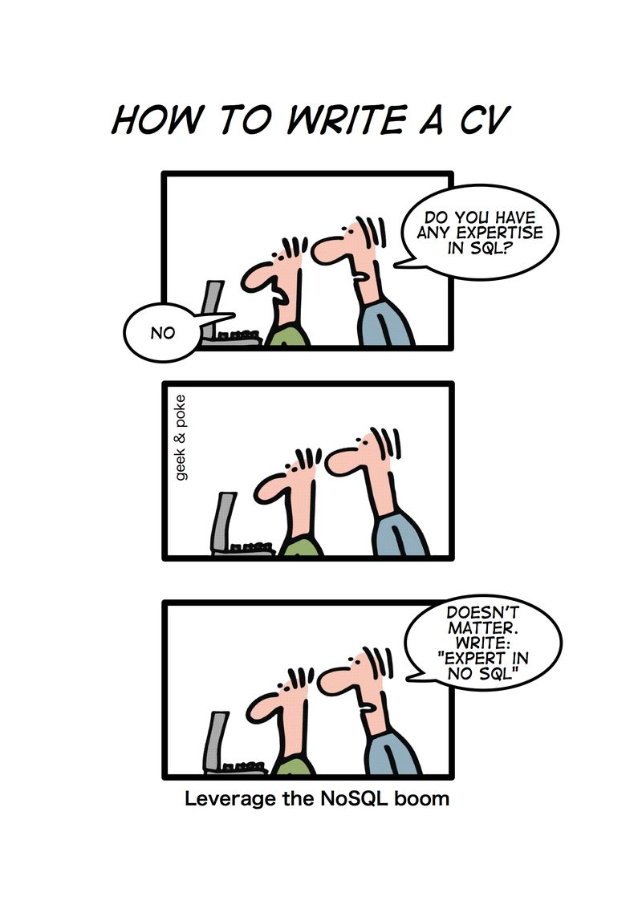
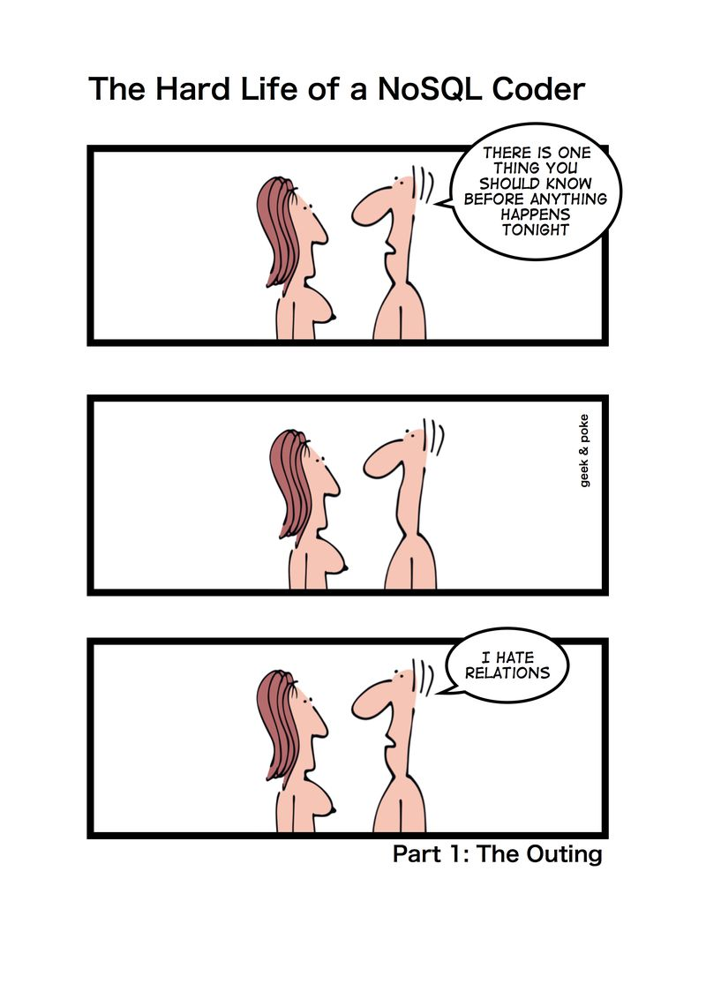

!SLIDE center light-on-dark

# 2. NoSQL - What's the Hype? #

!SLIDE full-page 
# What we'll discuss #
## Background ##
* SQL
* Hype vs. Reality
* vs. SQL
* Types

!SLIDE full-page 
# What we'll discuss#
## Implementations ##
* Redis
* Couch
* Mongo
* Membase

!SLIDE full-page
# SQL#
* Structured Query Language
* Different Implementations (PL/SQL, T-SQL)
* Key Word: STRUCTURE

!SLIDE full-page
  
# Properties of RDBMS #
* Well defined properties of objects
* Highly transactional systems
* Relations are important
* Once defined, difficult to change
* Performance problems for NULL

!SLIDE full-page
# NoSQL #

 

!SLIDE full-page
# Lots of "No" #

  

!SLIDE full-page
# Lots of "No" #
* No Queries (in the traditional sense)

!SLIDE full-page
# Lots of "Yes" #
* SPEED
* Easily Distributed
* Redundancy
* Flexibility

!SLIDE full-page 
# NoSQL Types
## Document ##
  - Store and operate on documents (a set of properties)
  - "Semi" Structured
  - Most Popular: CouchDB

!SLIDE full-page 
# NoSQL Types
## Key/Value Stores ##
  - No fixed data model
  - Can be in memory (very, very fast)
  - Most Popular: memcached, redis

!SLIDE full-page
# NoSQL Types
## Graph ##
  - Graph theory (think twitter)
  - Extremely fast for mapping (duh!) relations
  - Most Popular: Neo4j

!SLIDE center light-on-dark

# 3. Implementations #

!SLIDE full-page
# Implementations

  

## CouchDB ##
  - Language: Erlang
  - Key points: ease of use, consistency 
  - Type: Document
  - Couchbase

!SLIDE full-page 
 
# Implementations

## CouchDB ##
  - Best Use:
    - Versioning of information
    - Accumulating lots of data, but which occasionally changes
    - Pre-defined queries make it very fast
  - Example uses:
    - CRM, CMS, etc.
    - Master-Master Replication (very cool!)

!SLIDE full-page
# Implementations

  

## MongoDB ##
  - Language: C++
  - Key points: most "SQL-like"
  - Type: Document
!SLIDE full-page 
 
# Implementations
## MongoDB ##
  - Best Use:
    - Dynamic queries vs. couchdb
    - Handles changing data very well (vs. couchdb)
    - Easiest to get familiar with
  - Example uses:
    - Anywhere you would use MySQL or PostgreSQL
    - Best when you need to quickly add columns to tables

!SLIDE full-page 
# Implementations

  

## Membase (Couchbase) ##
  - Language: Erlang & C
  - Key points: memcache + clustering and persistance
  - Type: Key/Value Store

!SLIDE full-page
 
# Implementations
## Membase (Couchbase) ##
  - Best Use:
    - Online gaming (Zynga uses this a lot)
    - Low-latency/high concurrency applications
  - Example uses:
    - Ad serving
    - Gaming (high concurrency)

!SLIDE full-page
# Implementations

  

## Redis ##
  - Language: C/C++
  - Key points: SPEED
  - Type: Key/Value Store

!SLIDE full-page
 
# Implementations
## Redis ##
  - Best Use:
    - Small data sets that need quick access
    - Anywhere you need a cache
    - Predictable database size (since its in-memory)
  - Example uses:
    - Analytics
    - Session store
    - Real-time data collection

!SLIDE full-page
# Implementations

	

## Neo4j ##
  - Language: Java
  - Key points: Connected data
  - Type: Graph

!SLIDE full-page
 
# Implementations
## Neo4j ##
  - Best Use:
    - Multi-pronged, connected, graphed data
    - Fully ACID compliant
    - Distant/Relations Calculations
  - Example Uses:
    - Network topologies
    - Social relations (ie, twitter)
    - Public transport link mapping

!SLIDE full-page
# Thank You
* http://spkr8.com/s/15462

